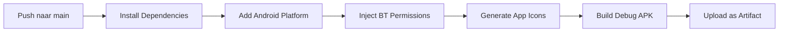

# 🚗 PidLane

<div align="center">
  <h2><strong>De auto praat. Wij vertalen.</strong></h2>
  <p>AI-gestuurde OBD2-diagnosetool voor professionele voertuigchecks</p>

  [](https://www.pidlane.nl)
  [](mailto:info@pidlane.nl)
  [](#)
</div>

---

## 📋 Inhoudsopgave

- [Over PidLane](#-over-pidlane)
- [Functionaliteiten](#-functionaliteiten)
- [Technische Stack](#-technische-stack)
- [Projectstructuur](#-projectstructuur)
- [APK Bouwen](#-apk-bouwen)
- [Bluetooth & Permissies](#-bluetooth--permissies)
- [Ondersteunde Adapters](#-ondersteunde-adapters)
- [Roadmap](#-roadmap)
- [Licentie](#-licentie)

---

## 🎯 Over PidLane

PidLane is een **intelligente OBD2-diagnosetool** speciaal ontworpen voor:
- 🏪 Autobedrijven
- 🚙 Occasionhandelaars
- 📥 Inkoop/Inruil afdelingen

De app draait als **web-app (PWA)** en **Android-APK** en verbindt met ELM327/STN-adapters via Bluetooth Classic en BLE.

**Beschikbaar op:** 🌐 [www.pidlane.nl](https://www.pidlane.nl)

---

## ⚡ Functionaliteiten

### 🚗 Koopcheck (2 minuten)
Snelle technische check voor aankoop of inruil met:
- Onderbouwde go/no-go beslissing
- Professioneel rapport
- Perfecte primaire flow voor verkoop en inkoop

### 📊 Uitgebreide Check (10 minuten)
Volledige rit-analyse met diepgaande diagnose:
- Motor & vermogen
- Brandstof & emissie
- Temperatuurgegevens
- Accu-status
- Rijgedrag & correlaties

### 🤖 AI-Diagnose op Klacht
- Beschrijf het symptoom
- AI analyseert waarschijnlijke oorzaken
- Bewijsvoering met live PID-data

### 📈 Aanvullende Features
- ✅ Algemene voertuigcheck (groen/oranje/rood)
- 📛 Foutcodes (DTC) scannen & uitleggen
- 📡 Live PID-data uitlezen
- 🎮 Neon-HUD dashboard
- ⛽ Brandstofbesparingsanalyse
- 📄 PDF-rapport (delen/opslaan)

---

## 🛠 Technische Stack

### Frontend
| Component | Technologie |
|-----------|------------|
| Web-App | Single `index.html` (PWA) |
| Desktop | Aparte `index-desktop.html` |
| Native Shell | [Capacitor](https://capacitorjs.com/) 6 |

### Connectivity (Cascade met Fallback)

```
1️⃣ SPP / Bluetooth Classic
   └─ @e-is/capacitor-bluetooth-serial
   └─ OBDLink MX+, etc.

2️⃣ BLE (Bluetooth Low Energy)
   └─ @capacitor-community/bluetooth-le
   └─ ELM327-klonen, Vgate, etc.

3️⃣ Web Bluetooth
   └─ Browser-native fallback
```

### Integraties
- 💾 **Opslag & Delen:** Capacitor Filesystem + Share API
- 🤖 **AI:** Anthropic API (optionele eigen key)
- 🔄 **Live Updates:** GitHub Pages CDN (front-end updates zonder APK-rebuild)

---

## 📁 Projectstructuur

```
PidLane/
│
├── index.html                    # 🌐 Web-app (GitHub Pages)
├── src/
│   ├── index.html               # Capacitor webDir
│   ├── index-desktop.html       # Desktop-variant
│   ├── config.js                # Adapter-configuratie (MAC-adressen)
│   └── version.json             # Versie-info voor auto-update
│
├── capacitor.config.json        # App-instellingen & plugins
├── package.json                 # Dependencies & scripts
├── version.json                 # Versiebestand
│
└── .github/workflows/
    └── build-apk.yml           # 🤖 CI/CD: Automatische APK-build
```

> ⚠️ **Belangrijk:** De **twee `index.html`-bestanden** moeten gesynchroniseerd blijven:
> - **Root `index.html`** → GitHub Pages
> - **`src/index.html`** → Capacitor webDir

---

## 🔨 APK Bouwen

### Automatische Build
De APK wordt **automatisch gebouwd** bij elke push naar `main` (of handmatig via `workflow_dispatch`).

### Build-proces:



### Workflow Details:

1. ✅ `npm install --legacy-peer-deps`
2. ✅ Android platform toegevoegd
3. ✅ **Bluetooth-permissies ingevoegd** in AndroidManifest.xml:
   - **Android 12+:** `BLUETOOTH_SCAN` + `BLUETOOTH_CONNECT` met `neverForLocation`
   - **Android ≤11:** Klassieke Bluetooth + `ACCESS_FINE_LOCATION`
4. ✅ App-icoon gegenereerd (alle densiteiten + adaptive icon)
5. ✅ Debug-APK gebouwd en uploadd

### Download APK:
```
Actions → Latest Run → Artifacts → PidLane-debug
```

---

## 📡 Bluetooth & Permissies

### BLE-initialisatie
```javascript
androidNeverForLocation: true  // ↔️ Gesynchroniseerd met workflow
```

> ⚠️ **Let op:** Als je deze instelling wijzigt, update dan ook `build-apk.yml`!

### SPP / Bluetooth Classic
- Verbindt op **bekend, gekoppeld MAC-adres** (uit `config.js`)
- ✅ Geen device-discovery nodig
- ✅ Geen locatie-permissie vereist
- 👉 Koppel adapter eenmalig via Android Bluetooth-instellingen

### Debug & Troubleshooting
Gebruik de ingebouwde **📡 Log-viewer** voor:
- Platform-info
- Android-versie
- Gekozen transport (SPP/BLE/Web)
- Kopieerbare diagnostische gegevens

---

## 📱 Ondersteunde Adapters

| Adapter | Type | Service | Status |
|---------|------|---------|--------|
| **OBDLink MX+** | SPP | Classic | ✅ Getest |
| **ELM327-BLE** | BLE | fff0/ffe0 | ✅ Getest |
| **Vgate-Klonen** | BLE | fff0/ffe0 | ✅ Getest |

> 💡 **Smart-selectie:** De BLE-scan kiest automatisch de adapter met het sterkste signaal.

---

## 🗺 Roadmap

- [ ] 🎯 Koopcheck prominenter en sneller in hoofd-flow
- [ ] 📄 Demo-rapport (PDF) op maat voor onafhankelijke occasionhandelaren
- [ ] 🧪 Verbindingsbetrouwbaarheid breder testen op oudere toestellen
- [ ] 🌍 Uitbreiding naar extra branches na validatie

---

## 📜 Licentie & Eigendom

```
© PidLane / NewspeedyNL
Alle rechten voorbehouden.
Niet voor herdistributie zonder expliciete toestemming.
```

---

<div align="center">

### 🚀 Klaar om te starten?

[🌐 Bezoek PidLane.nl](https://www.pidlane.nl) · [📧 Neem contact op](mailto:info@pidlane.nl)

**Made with ❤️ by NewspeedyNL**

</div>
