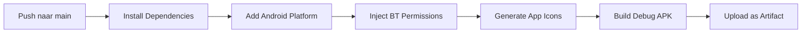

# 🚗 PidLane

<div align="center">
  <h2><strong>De auto praat. Wij vertalen.</strong></h2>
  <p>AI-gestuurde OBD2-diagnosetool voor professionele voertuigchecks</p>

  [](https://www.pidlane.nl)
  [](mailto:info@pidlane.nl)
  [](#)
</div>

---

## 📋 Inhoudsopgave

- [Over PidLane](#-over-pidlane)
- [Functionaliteiten](#-functionaliteiten)
- [Technische Stack](#-technische-stack)
- [Projectstructuur](#-projectstructuur)
- [Backend: Cloudflare Worker](#-backend-cloudflare-worker)
- [APK Bouwen](#-apk-bouwen)
- [Bluetooth & Permissies](#-bluetooth--permissies)
- [Ondersteunde Adapters](#-ondersteunde-adapters)
- [Roadmap](#-roadmap)
- [Licentie](#-licentie)

---

## 🎯 Over PidLane

PidLane is een **intelligente OBD2-diagnosetool** speciaal ontworpen voor:
- 🏪 Autobedrijven
- 🚙 Occasionhandelaars
- 📥 Inkoop/Inruil afdelingen

De app draait als **web-app (PWA)** en **Android-APK** en verbindt met ELM327/STN-adapters via Bluetooth Classic en BLE.

**Beschikbaar op:** 🌐 [www.pidlane.nl](https://www.pidlane.nl)

---

## ⚡ Functionaliteiten

### 🚗 Koopcheck (2 minuten)
Snelle technische check voor aankoop of inruil met:
- Onderbouwde go/no-go beslissing
- Professioneel rapport
- Perfecte primaire flow voor verkoop en inkoop

### 📊 Uitgebreide Check (10 minuten)
Volledige rit-analyse met diepgaande diagnose:
- Motor & vermogen
- Brandstof & emissie
- Temperatuurgegevens
- Accu-status
- Rijgedrag & correlaties

### 🤖 AI-Diagnose op Klacht
- Beschrijf het symptoom
- AI analyzeert waarschijnlijke oorzaken
- Bewijsvoering met live PID-data

### 📈 Aanvullende Features
- ✅ Algemene voertuigcheck (groen/oranje/rood)
- 📛 Foutcodes (DTC) scannen & uitleggen
- 📡 Live PID-data uitlezen
- 🎮 Neon-HUD dashboard
- ⛽ Brandstofbesparingsanalyse
- 📄 PDF-rapport (delen/opslaan)

---

## 🛠 Technische Stack

### Frontend
| Component | Technologie |
|-----------|------------|
| Web-App | Single `index.html` (PWA) |
| Native Shell | [Capacitor](https://capacitorjs.com/) 6 |
| Styling | `pidlane.css` (externe stylesheet) |
| Modular JS | 8 gekoppelde JavaScript-modules |

### Modulaire Architectuur (Build: 2026-07-19)
**Index.html is opgesplitst naar 8 aparte bestanden voor betere onderhoudsbaarheid:**

1. **pidlane-data.js** (Ronde 1 — head-loads)
   - Statische referentiedata: PIDs, PID_HARD_LIMITS, MODELS/MOTORS, DTCDB
   - Analyses-checklijsten, BSC_TESTS, COMPLAINT_FOCUS, FUEL_PIDS
   - Scenario-presets, STRATEGIE_INFO, AUTO_KENNIS

2. **pidlane-assets.js** (Ronde 1 — head-loads)
   - Ingebedde media (BANDEN_IMG, 200 KB base64-JPEG)

3. **pidlane.css** (Ronde 1 — head-loads)
   - Volledige hoofd-stylesheet

4. **pidlane-veldlab.js** (Ronde 2 — body modules)
   - Veldlab-sessies, Airtable-cloudsync
   - Full Veldlab Survey v2 (47 KB)

5. **pidlane-archief.js** (Ronde 2 — body modules)
   - Sessie-rapportarchief incl. AI-context-keuze (24 KB)

6. **pidlane-bt.js** (Ronde 2 — body modules)
   - Universele Bluetooth-laag: SPP/BLE/Web Serial/Web Bluetooth
   - Commando-mutex, connectie-optimalisatie (77 KB)

7. **pidlane-koopcheck.js** (Ronde 2 — body modules)
   - Complete koopcheck-module (130 KB)
   - RDW-datavalidatie, onderhoud plannen, EV/hybride-check

8. **pidlane-remote.js** (Ronde 2 — body modules)
   - Remote-diagnosemodule: sessie delen, live meekijken

**Validatie:** node --check op alle 8 JS-bestanden, DIV-balans, data-file standalone-compatible.

### Connectivity (Cascade met Fallback)

```
1️⃣ SPP / Bluetooth Classic
   └─ @e-is/capacitor-bluetooth-serial
   └─ OBDLink MX+, etc.

2️⃣ BLE (Bluetooth Low Energy)
   └─ @capacitor-community/bluetooth-le
   └─ ELM327-klonen, Vgate, etc.

3️⃣ Web Bluetooth
   └─ Browser-native fallback
```

### Integraties
- 💾 **Opslag & Delen:** Capacitor Filesystem + Share API
- 🤖 **AI:** Anthropic API (optionele eigen key, of server-side fallback)
- 🔄 **Live Updates:** GitHub Pages CDN (front-end updates zonder APK-rebuild)
- 🌐 **Remote Diagnose:** Cloudflare Durable Objects (sessie-scoped sharing)

---

## 📁 Projectstructuur

```
PidLane/
│
├── index.html                    # 🌐 Web-app main (GitHub Pages)
├── pidlane-data.js               # Referentiedata (PIDs, DTC, modellen)
├── pidlane-assets.js             # Ingebedde media (base64)
├── pidlane.css                   # Hoofd-stylesheet
├── pidlane-veldlab.js            # Veldlab & Airtable-sync
├── pidlane-archief.js            # Sessie-rapportarchief
├── pidlane-bt.js                 # Bluetooth-universele laag
├── pidlane-koopcheck.js          # Koopcheck-module
├── pidlane-remote.js             # Remote-diagnose
├── pidlane-veldlab.html          # 🧪 Standalone Veldlab-analyse tool
│
├── config.js                     # Adapter-config (MAC-adressen, endpoints)
├── package.json                  # Dependencies & scripts
├── capacitor.config.json         # App-instellingen & plugins
├── version.json                  # Versiebestand (auto-update)
│
├── worker.js                     # 🔐 Cloudflare Worker (BACKEND)
│                                 # Auth, AI-proxy, Airtable, remote sessions
│
├── .github/workflows/
│   └── build-apk.yml            # 🤖 CI/CD: Automatische APK-build
│
└── README.md                     # Deze file

```

---

## 🔐 Backend: Cloudflare Worker

**worker.js** is de centrale backend-proxy. Draait op Cloudflare Workers en zorgt ervoor dat **gèn geheimen in de client staan**.

### Endpoints (via worker.js)

#### Authenticatie
- **POST /auth/login** → {user, pass} → ondertekend sessietoken
  - Geen APP_TOKEN meer in de client
  - Token-TTL standaard 12 uur
  - SHA-256 wachtwoord-verificatie

#### AI & Integraties
- **POST /v1/messages** → proxy naar Anthropic Claude API
- **POST /airtable/log** → logs/usage naar Airtable (Logs-tabel)
- **POST /airtable/veldlab** → veldlab-sessies naar Airtable (Veldlab-base)
- **POST /airtable/reference** → gepromoveerde referentiedata (UPSERT op RefID)

#### Remote Diagnose (Live Meekijken)
- **POST /session/create** → {sessionId, localToken, joinToken}
- **POST /session/telemetry** → push telemetrie-frame
- **GET /session/state** → lees metadata + frames
- **GET /session/connect** → WebSocket expert-aansluiting
- **POST /session/close** → sluit sessie netjes af

#### Korte Meekijk-Code (10 cijfers)
- **POST /code/create** → {sessionId, joinToken} → 10-cijferige code
- **POST /code/resolve** → code → {sessionId, joinToken}

#### QR-Pairing
- **POST /pair/create** → {pairId, claimToken, pollToken}
- **POST /pair/claim** → expert-sessie claimen
- **GET /pair/poll** → polling voor expert (asymmetrisch geheim)

#### Config Management
- **GET /api/config** → remote configuratie (gecached)
- **POST /api/config** → admin schrijft config weg
- **GET /admin/users** → gebruikers-lijst (ZONDER hashes)
- **POST /admin/users** → save/delete gebruikers

#### Utility
- **GET /proxy?url=…** → RDW/NHTSA allowlist proxy
- **GET /** → health-check

### Environment Variables (Cloudflare)

**Secrets (encrypted):**
- `SESSION_SECRET` — HMAC-ondertekening sessietokens
- `USERS_JSON` — accounts als JSON: `{"Nico":{"passHash":"<sha256>","role":"admin"}}`
- `ANTHROPIC_API_KEY` — Anthropic API-key (sk-ant-…)
- `AIRTABLE_TOKEN` — Personal Access Token
- `ADMIN_TOKEN` — Admin-geheim voor config-beheer
- `APP_TOKEN` — LEGACY (overgangsperiode, wordt afgebouwd)

**Plain Vars:**
- `TOKEN_TTL_HOURS` — geldigheid sessietoken (standaard 12)
- `AIRTABLE_LOG_BASE` — Logs-base ID
- `AIRTABLE_VL_BASE` — Veldlab-base ID
- [en andere Airtable-tabel-IDs]

### Durable Objects (Remote Diagnose)

**RemoteSessionDO** — één instance per sessie
- WebSocket-beheer (local + experts)
- Telemetrie-buffering (ring van 50 frames)
- Voertuigprofiel-snapshot (vstate) caching
- Audit-trail (qué vroeg wat)
- Sessie-TTL & expiratie

**Binding:**
```
name: REMOTE_SESSION
class: RemoteSessionDO
migratie: new_sqlite_classes = ["RemoteSessionDO"]
```

---

## 🔨 APK Bouwen

### Automatische Build
De APK wordt **automatisch gebouwd** bij elke push naar `main` (of handmatig via `workflow_dispatch`).

### Build-proces:



### Workflow Details:

1. ✅ `npm install --legacy-peer-deps`
2. ✅ Android platform toegevoegd
3. ✅ **Bluetooth-permissies ingevoegd** in AndroidManifest.xml:
   - **Android 12+:** `BLUETOOTH_SCAN` + `BLUETOOTH_CONNECT` met `neverForLocation`
   - **Android ≤11:** Klassieke Bluetooth + `ACCESS_FINE_LOCATION`
4. ✅ App-icoon gegenereerd (alle densiteiten + adaptive icon)
5. ✅ Debug-APK gebouwd en uploadd

### Download APK:
```
Actions → Latest Run → Artifacts → PidLane-debug
```

---

## 📡 Bluetooth & Permissies

### BLE-initialisatie
```javascript
androidNeverForLocation: true  // ↔️ Gesynchroniseerd met workflow
```

> ⚠️ **Let op:** Als je deze instelling wijzigt, update dan ook `build-apk.yml`!

### SPP / Bluetooth Classic
- Verbindt op **bekend, gekoppeld MAC-adres** (uit `config.js`)
- ✅ Geen device-discovery nodig
- ✅ Geen locatie-permissie vereist
- 👉 Koppel adapter eenmalig via Android Bluetooth-instellingen

### Debug & Troubleshooting
Gebruik de ingebouwde **📡 Log-viewer** voor:
- Platform-info
- Android-versie
- Gekozen transport (SPP/BLE/Web)
- Kopieerbare diagnostische gegevens

---

## 📱 Ondersteunde Adapters

| Adapter | Type | Service | Status |
|---------|------|---------|--------|
| **OBDLink MX+** | SPP | Classic | ✅ Getest |
| **ELM327-BLE** | BLE | fff0/ffe0 | ✅ Getest |
| **Vgate-Klonen** | BLE | fff0/ffe0 | ✅ Getest |

> 💡 **Smart-selectie:** De BLE-scan kiest automatisch de adapter met het sterkste signaal.

---

## 📊 File Integrity

### HTML-bestanden
- **index.html** — Main web-app
- **pidlane-veldlab.html** — Standalone Veldlab-analyse tool

**OPMERKING:** Eerder stond "9 HTML-bestanden" in de metadata, maar dit was onjuist. De repository bevat slechts **2 HTML-bestanden**. De split naar 8 JavaScript-modules zorgt ervoor dat het maintainability verbetert (1264 KB → 535 KB, -58%).

### JavaScript-modules (8 stuks)
- pidlane-data.js
- pidlane-assets.js
- pidlane-veldlab.js
- pidlane-archief.js
- pidlane-bt.js
- pidlane-koopcheck.js
- pidlane-remote.js
- config.js

### Wat kan weg?
**Niets essentieel — alles is actief in use:**
- `worker.js` — Backend, verplicht
- `.github/workflows/build-apk.yml` — CI/CD, behoud voor automatische builds
- `package.json`, `capacitor.config.json` — Projectconfiguratie
- `version.json` — Auto-update systeem

---

## 🗺 Roadmap

- [ ] 🎯 Koopcheck prominenter en sneller in hoofd-flow
- [ ] 📄 Demo-rapport (PDF) op maat voor onafhankelijke occasionhandelaren
- [ ] 🧪 Verbindingsbetrouwbaarheid breder testen op oudere toestellen
- [ ] 🌍 Uitbreiding naar extra branches na validatie
- [ ] ⚡ Performance-optimalisatie: lazy-loading modules
- [ ] 🔒 Enhanced security: sessie-rotation, CSRF-tokens

---

## 📜 Licentie & Eigendom

```
© PidLane / NewspeedyNL
Alle rechten voorbehouden.
Niet voor herdistributie zonder expliciete toestemming.
```

---

<div align="center">

### 🚀 Klaar om te starten?

[🌐 Bezoek PidLane.nl](https://www.pidlane.nl) · [📧 Neem contact op](mailto:info@pidlane.nl)

**Made with ❤️ by NewspeedyNL**

</div>
